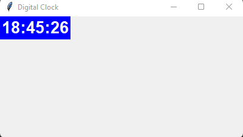

# DIGITAL CLOCK :

It is a digital clock which displays the current time which refreshes automatically after every `1000 milliseconds` 

### Language used :

### Prerequsities : 
- Python3 
- A code editor like VS code

### To change the color of the clock : 
- `label = Label(canvas,font =('Helvetica',20,'bold'),bg='blue',fg='white')`
- change the bg color to change the background 
- change the fg color to change the color of the text

### Screenshot : 
